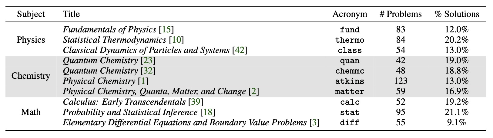
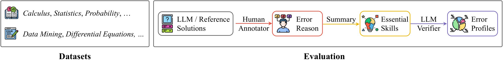

# SciBench
SciBench is a novel benchmark for college-level scientific problems consisting of 694
problems sourced from instructional textbooks, as well as 7 sets of exams derived from actual
classroom assessments. The benchmark is designed to evaluate the complex reasoning capabilities,
strong domain knowledge, and advanced calculation skills of LLMs.

We developed an innovative evaluation protocol for a detailed analysis of reasoning abilities. This
involves instructing LLMs to self-identify and categorize their errors within a predefined set of
capabilities. This process offers a fine-grained understanding of where the models are falling short.

## Data


The SciBench dataset is under dataset folder in json file format. Each file is list of dictionary and can be extracted using following scripts.
We have lsit of subjects where each subjects stands for one textbook, which is fully elaborated in the paper. 

```
subject='atkins'
with open("./data/{}.json".format(subject), encoding='utf-8') as json_file:
    problems=json.load(json_file)

```

## Evaluation
To evaluate our data using LLM, please refer to folder under eval

## Analysis (Evaluation Protocol)


The evaluation protocol involves analyzing both LLM
and reference (correct) solutions with the assistance of human annotators to identify error reasons.
These reasons are then summarized into ten essential scientific problem-solving skills in which LLM
may face challenges. Subsequently, a LLM verifier is employed to automatically attribute each
incorrectly answered problem to a lack of a specific skill. The resulting error profiles enable the
interpretation of the improved skills by certain prompting strategies and direct comparison of various
strategies.
### run evaluation protocol
After running the evaluation part, use the output to run the evaluation protocol. "setting" refers to the experiment setting: zero_nosys, zero, zeroCot, few, fewCot, python, wolfram, which are fully explained under eval folder.
```
cd eval
OPENAI_API_KEY=your_key python ana_error.py --setting your_setting 
```

